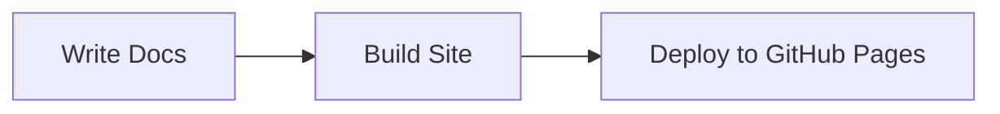

# Documentation Website — Astro + Starlight

Use this instruction when scaffolding, configuring, or maintaining a documentation website built with Astro and the Starlight theme.

## Technology Stack

| Technology | Purpose |
|---|---|
| **Astro** | Static site generator / web framework |
| **@astrojs/starlight** | Documentation theme (search, i18n, navigation, ToC) |
| **Node.js 24** | Runtime |
| **TypeScript (strict)** | Type checking via `astro/tsconfigs/strict` |
| **astro-mermaid** | Mermaid diagram rendering in Markdown |
| **starlight-links-validator** | Internal link validation at build time |
| **starlight-llms-txt** | Generates `llms.txt` for AI-friendly crawling |
| **sharp** | Image optimization |

## 1 — Scaffolding

Initialize the `docs/` folder from the Starlight template, then replace generated dependencies with the pinned set.

```bash
npm create astro@latest -- --template starlight docs
```

### Reference `package.json`

```jsonc
{
  "name": "docs",
  "type": "module",
  "scripts": {
    "dev": "astro dev",
    "build": "astro build",
    "preview": "astro preview",
    "astro": "astro"
  },
  "dependencies": {
    "astro": "^5.18.0",
    "@astrojs/starlight": "^0.37.6",
    "astro-mermaid": "^1.3.1",
    "sharp": "^0.34.5",
    "starlight-links-validator": "^0.19.2",
    "starlight-llms-txt": "^0.7.0"
  }
}
```

### `tsconfig.json`

```json
{
  "extends": "astro/tsconfigs/strict"
}
```

## 2 — Project Structure

```
docs/
├── astro.config.mjs
├── package.json
├── tsconfig.json
├── public/
│   └── favicon.svg
└── src/
    ├── content.config.ts
    ├── content/
    │   └── docs/
    │       ├── index.mdx
    │       ├── introduction/
    │       ├── getting-started/
    │       ├── guides/
    │       ├── reference/
    │       └── contributing/
    └── styles/
        └── custom.css
```

- Place the landing page at `src/content/docs/index.mdx`.
- Organize content into topic folders under `src/content/docs/`.
- Use MDX for pages that need interactive components.
- Static assets (favicon, images) go in `public/`.

### Content collection schema (`src/content.config.ts`)

```ts
import { defineCollection } from "astro:content";
import { docsSchema } from "@astrojs/starlight/schema";

export const collections = {
  docs: defineCollection({ schema: docsSchema() }),
};
```

### Frontmatter conventions

Every content page must include `title` and `description`:

```yaml
---
title: Getting Started
description: How to install and run the project.
---
```

Use `sidebar` overrides when the auto-generated label is not suitable:

```yaml
---
title: API Reference
sidebar:
  label: API
  order: 1
---
```

## 3 — Astro Configuration

### Reference `astro.config.mjs`

```js
import { defineConfig } from "astro/config";
import starlight from "@astrojs/starlight";
import starlightLinksValidator from "starlight-links-validator";
import starlightLlmsTxt from "starlight-llms-txt";
import { astroMermaid } from "astro-mermaid";

export default defineConfig({
  site: "https://<org>.github.io",
  base: "/<repo>",
  integrations: [
    starlight({
      title: "<Project Name>",
      description: "<Project description>",
      favicon: "/favicon.svg",
      plugins: [starlightLinksValidator(), starlightLlmsTxt()],
      social: [
        {
          icon: "github",
          label: "GitHub",
          href: "https://github.com/<org>/<repo>",
        },
      ],
      sidebar: [
        { label: "Introduction", slug: "introduction" },
        { label: "Getting Started", slug: "getting-started" },
        {
          label: "Guides",
          items: [
            { label: "First Guide", slug: "guides/first-guide" },
          ],
        },
        { label: "Reference", autogenerate: { directory: "reference" } },
        {
          label: "Contributing",
          autogenerate: { directory: "contributing" },
        },
      ],
      tableOfContents: { minHeadingLevel: 2, maxHeadingLevel: 4 },
      pagination: true,
      expressiveCode: true,
      customCss: ["./src/styles/custom.css"],
    }),
    astroMermaid(),
  ],
});
```

### Key configuration patterns

- **`site` and `base`** — set for GitHub Pages routing (`https://<org>.github.io/<repo>/`).
- **Sidebar** — combine manual slugs for top-level pages with `autogenerate` for reference and contributing sections.
- **Table of Contents** — include headings from level 2 through 4.
- **Expressive Code** — enabled by default; provides copy-to-clipboard on code blocks.
- **Custom CSS** — reference a stylesheet for branding overrides.

## 4 — Mermaid Diagrams

The `astro-mermaid` integration renders fenced Mermaid blocks in Markdown/MDX.

````markdown

````

No additional configuration is needed beyond registering `astroMermaid()` in the integrations array.

## 5 — Custom Styling

Create `src/styles/custom.css` and reference it in `customCss`. Override Starlight CSS custom properties for branding:

```css
:root {
  --sl-color-accent-low: #1a1a2e;
  --sl-color-accent: #4361ee;
  --sl-color-accent-high: #b8c0ff;
  --sl-font-system: "Inter", -apple-system, BlinkMacSystemFont, sans-serif;
}
```

Consult the [Starlight CSS custom properties reference](https://starlight.astro.build/reference/css-variables/) for the full list of tokens.

## 6 — GitHub Pages Deployment

### Reference GitHub Actions workflow

Create `.github/workflows/deploy-docs.yml`:

```yaml
name: Deploy Docs

on:
  push:
    branches: [main]
    paths:
      - "docs/**"
  workflow_dispatch:

permissions:
  contents: read
  pages: write
  id-token: write

concurrency:
  group: pages
  cancel-in-progress: true

jobs:
  build:
    runs-on: ubuntu-latest
    defaults:
      run:
        working-directory: docs
    steps:
      - uses: actions/checkout@v4
      - uses: actions/setup-node@v4
        with:
          node-version: 24
          cache: npm
          cache-dependency-path: docs/package-lock.json
      - run: npm ci
      - run: npm run build
      - uses: actions/upload-pages-artifact@v3
        with:
          path: docs/dist

  deploy:
    needs: build
    runs-on: ubuntu-latest
    environment:
      name: github-pages
      url: ${{ steps.deployment.outputs.page_url }}
    steps:
      - id: deployment
        uses: actions/deploy-pages@v4
```

### Deployment notes

- The workflow triggers on pushes to `main` that change files under `docs/`.
- `workflow_dispatch` allows manual deployment.
- Ensure **GitHub Pages** is configured to use **GitHub Actions** as the source in the repository settings.
- The `concurrency` group prevents overlapping deployments.

## 7 — Development Workflow

```bash
cd docs
npm install          # Install dependencies
npm run dev          # Start local dev server with hot reload
npm run build        # Production build (runs link validation)
npm run preview      # Preview the production build locally
```

- Link validation runs automatically at build time via `starlight-links-validator`. Fix any broken links before merging.
- Use `npm run dev` for iterative content authoring with live reload.

## 8 — AI-Friendly Output

The `starlight-llms-txt` plugin generates a `/llms.txt` file at build time, making documentation discoverable by AI agents and LLM crawlers. No additional configuration is required beyond registering the plugin.
