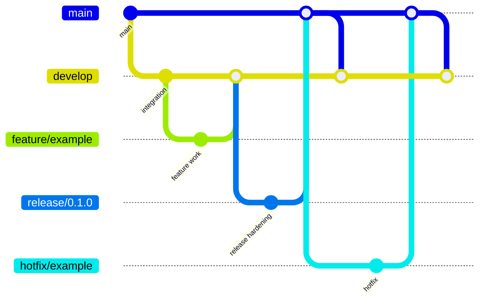

# Contributing to Agent Profiler

Agent Profiler is an Electron, React, and EPAM UUI desktop application for visualising AI coding-agent session logs from Copilot CLI, VS Code Copilot Chat, and ctb benchmark runs. It succeeds the `ctb viz` HTML prototype and will grow through small, reviewed GitFlow changes.

## Local prerequisites

Feature implementation starts in a follow-up PR. Once the application scaffold exists, contributors should use:

- Node.js 20 LTS
- pnpm

Do not add alternative package managers, lockfiles, or framework configuration unless an approved issue explicitly asks for them.

## Branch model

This repository uses GitFlow:

- `main` is the protected release branch.
- `develop` is the integration branch for feature work.
- Feature branches use `feature/<slug>` and target `develop`.
- Release branches use `release/x.y.z`.
- Hotfix branches use `hotfix/<slug>` and are merged back into both `main` and `develop`.

## Commit convention

Use [Conventional Commits](https://www.conventionalcommits.org/):

- `feat: add session import workflow`
- `fix: handle empty benchmark timeline`
- `docs: document backlog conventions`
- `chore: update repository templates`

Keep commits focused and explain the reason for non-obvious changes in the body.

## Picking up an issue

1. Choose an issue labelled by type (`type:epic`, `type:feature`, `type:task`, `type:bug`, or `type:spike`) and phase (`phase:p0` through `phase:p6`).
2. Check the requested specialist role: developer, infrastructure, testing, testing-automation, code-quality, tech-writer, business-analyst, release-manager, or onboarding-coach.
3. Comment with your intended approach before starting if the issue is not already assigned.
4. Create a branch from `develop` using the branch naming rules above.

## Pull requests

Open focused PRs against `develop` unless you are preparing an approved release or hotfix. The bootstrap PR is the only initial exception and targets `main` directly.

Every PR must satisfy the Definition of Done from `.github/PULL_REQUEST_TEMPLATE.md`:

- Pull Request created
- Requirements fully met
- Copilot Review requested and feedback addressed
- Code review feedback received and no errors remain
- PR is merged back to `develop` (or `main` for the bootstrap/release PRs)

Include testing notes, screenshots for UI changes, breaking-change notes, and documentation updates where relevant.

## Questions and discussions

Use [GitHub Discussions](https://github.com/epam-ubb-demo/agent-profiler/discussions) for questions, design proposals, and community coordination. Use the security policy for vulnerability reports instead of public discussions.
