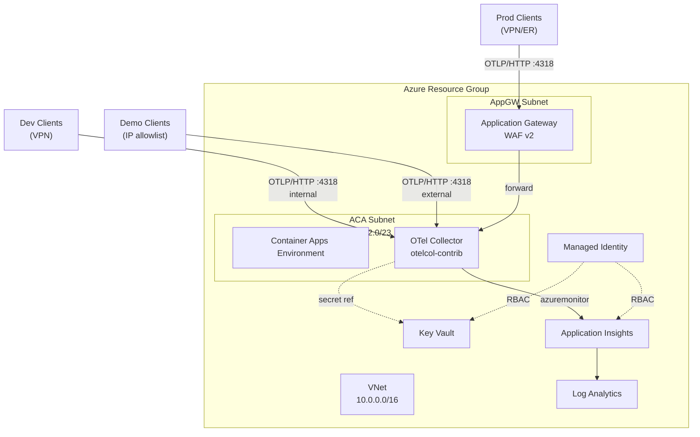

# OTel Gateway — Infrastructure

Pulumi IaC for deploying a centralised OpenTelemetry Collector gateway on Azure Container Apps. Part of the Agent Profiler monorepo.

---

## Prerequisites

| Tool | Version | Install |
|------|---------|---------|
| **Pulumi CLI** | ≥ 3.100 | [Install guide](https://www.pulumi.com/docs/install/) |
| **Azure CLI** | latest | [Install guide](https://learn.microsoft.com/en-us/cli/azure/install-azure-cli) |
| **Node.js** | ≥ 20 | [nodejs.org](https://nodejs.org/) |
| **pnpm** | latest | Workspace package manager |

### Azure RBAC Roles Required

- **Contributor** on the target resource group (or subscription for initial deployment)
- **Key Vault Administrator** for secret management
- **Monitoring Contributor** for alert rules

---

## Quick Start

```bash
# 1. Clone the monorepo (if not already)
git clone https://github.com/epam-ubb-demo/agent-profiler.git
cd agent-profiler

# 2. Install dependencies
pnpm install

# 3. Navigate to infrastructure
cd infra/otel

# 4. Log in to Azure
az login

# 5. Initialise Pulumi (local backend)
pulumi login --local

# 6. Select or create a stack
pulumi stack select dev  # or: pulumi stack init dev

# 7. Preview the deployment
pulumi preview --stack dev
```

---

## Architecture



Developer workstations send OTLP/HTTP telemetry to the OTel Collector running on Azure Container Apps. The traffic path varies by environment: **Dev** clients connect directly to the Container App via internal VNet (VPN required); **Demo** clients connect directly via external ingress with IP allowlist restrictions; **Prod** clients connect through an Application Gateway (WAF v2) for TLS termination and web application firewall protection. The collector processes telemetry (PII redaction, enrichment, batch processing) and exports to Application Insights via the azuremonitor exporter. All secrets are stored in Key Vault and accessed via Managed Identity.

---

## Configuration Reference

All values are set via `pulumi config set <key> <value>`.

| Key | Type | Default | Description |
|-----|------|---------|-------------|
| `azure-native:location` | string | `eastus` | Azure region for all resources |
| `environment` | string | *(required)* | Deployment environment: `dev`, `demo`, or `prod` |
| `region` | string | *(required)* | Azure region shortname |
| `instance` | string | *(required)* | Instance identifier (e.g. `001`) |
| `vnetCidr` | string | `10.0.0.0/16` | Virtual network address space |
| `acaSubnetCidr` | string | `10.0.2.0/23` | Container Apps subnet CIDR |
| `platformReservedCidr` | string | `10.0.4.0/22` | ACA platform reserved CIDR ⚠️ |
| `platformReservedDnsIP` | string | `10.0.4.2` | ACA platform reserved DNS IP ⚠️ |
| `dockerBridgeCidr` | string | `172.17.0.1/16` | Docker bridge network CIDR ⚠️ |
| `agwSubnetCidr` | string | `10.0.1.0/24` | Application Gateway subnet CIDR (prod only) |
| `logRetentionDays` | number | `30` | Log Analytics retention in days (90 for prod) |
| `otelCollectorImage` | string | `otel/opentelemetry-collector-contrib` | OTel Collector container image |
| `otelCollectorTag` | string | `0.102.0` | OTel Collector image tag |
| `enableResourceLocks` | boolean | `false` | Enable CanNotDelete locks (prod only) |
| `enableAppGateway` | boolean | `false` | Deploy Application Gateway WAF v2 (prod only) |
| `minReplicas` | number | `0` | Minimum container replicas (3 for prod) |
| `maxReplicas` | number | `2` | Maximum container replicas (10 for prod) |
| `publicAccess` | boolean | `false` | Enable external ingress (demo only) |
| `allowedIpRanges` | string | — | Comma-separated CIDR ranges for IP allowlist (demo only) |
| `samplingPercentage` | number | `10` | Tail sampling percentage for normal traces (prod only) |

> ⚠️ `platformReservedCidr`, `platformReservedDnsIP`, and `dockerBridgeCidr`
> are reserved for future use with workload profile environments. They are
> currently unused by the Consumption-only Container Apps Environment.

---

## Environment Comparison

| Aspect | Dev | Demo | Prod |
|--------|-----|------|------|
| Network | Private (VNet-only) | Public with IP allowlist | Private (VPN/ExpressRoute) |
| Application Gateway | Skipped | Skipped | WAF_v2, zone-redundant |
| ACA ingress | Internal | External (IP-restricted) | Internal (via AppGW) |
| ACA replicas | 0–2 (scale-to-zero) | 0–2 (scale-to-zero) | 3–10 (always-on) |
| ACA resources | 0.25 cpu / 0.5Gi | 0.25 cpu / 0.5Gi | 1.0 cpu / 2.0Gi |
| Zone redundancy | No | No | Yes |
| Key Vault hardening | Soft-delete only | Soft-delete only | Soft-delete + purge protection |
| Resource locks | No | No | CanNotDelete |
| Log retention | 30 days | 30 days | 90 days |
| Tail sampling | No | No | 100% errors, 10% normal |
| Debug exporter | Yes | Yes | No |
| Estimated cost | ~$0 | ~$5–15/mo | ~$400–600/mo |

---

## Project Structure

```
infra/otel/
├── Pulumi.yaml              # Project definition
├── Pulumi.dev.yaml           # Dev stack configuration
├── Pulumi.demo.yaml          # Demo stack configuration
├── Pulumi.prod.yaml          # Prod stack configuration
├── config/
│   ├── otel-collector.yaml       # Dev collector config
│   ├── otel-collector.demo.yaml  # Demo collector config
│   └── otel-collector.prod.yaml  # Prod collector config
├── src/
│   ├── index.ts              # Main entry point
│   ├── container-app.ts      # Container Apps resources
│   ├── identity.ts           # Managed Identity & role assignments
│   ├── keyvault.ts           # Key Vault resources & secrets
│   ├── monitoring.ts         # Log Analytics, App Insights, alerts
│   ├── network.ts            # VNet, subnets, NSGs
│   ├── naming.ts             # Resource naming conventions
│   ├── tags.ts               # Resource tagging
│   └── types.ts              # Shared TypeScript interfaces
├── package.json
└── tsconfig.json
```

---

## Related Documentation

- [ADR-0008 — OTel Gateway Architecture](../../docs/decisions/ADR-0008-otel-gateway-architecture.md)
- [Integration Handover](../../docs/guides/otel-integration-handover.md)
- [Client Configuration Guide](../../docs/guides/otel-client-configuration.md)
- [Operations Runbook](../../docs/runbooks/otel-gateway-operations.md)
